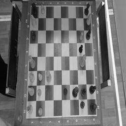
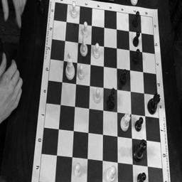
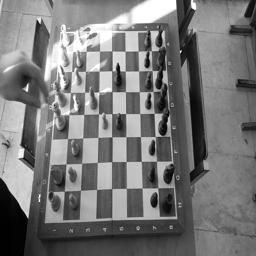
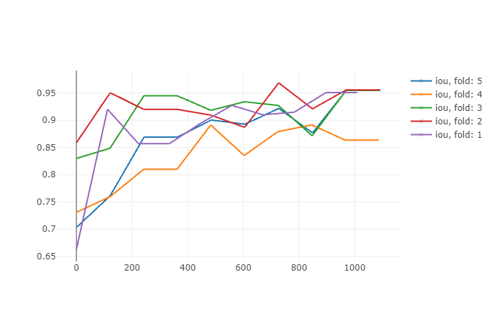
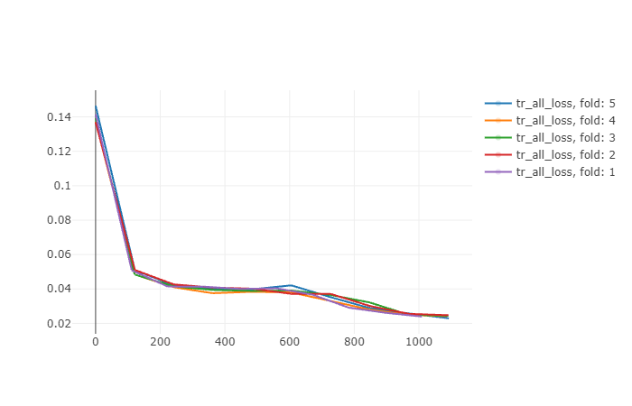

# myte

В качестве тестового задания предлагается проблема поиска
шахматной доски. Вам дается два набора данных (xtrain, ytrain) и xtest.
Формат данных – массив NumPy. Требуется построить модель одного на
Ваш выбор алгоритма машинного обучения, обучить на xtrain и
предсказать ytest для xtest.

Visual train images:

filename3618               |filename6244               |filename8170
:-------------------------:|:-------------------------:|:-------------------------:
 |  | 

[Ссылка для скачивания данных](https://yadi.sk/d/Yv86Kan3BWoEnQ)

[Пример видео с шахматной партией со смартфона](https://yadi.sk/i/y1Lp_oILRiEUgQ)

Result model (used only 200 images, train:160  valid:40):

IOU                        |  Train loss
:-------------------------:|:-------------------------:
 | 
